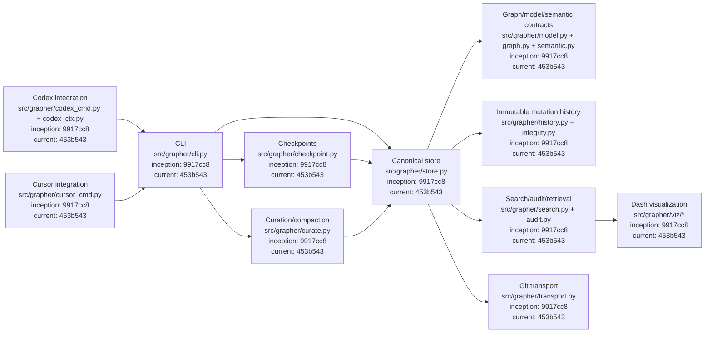
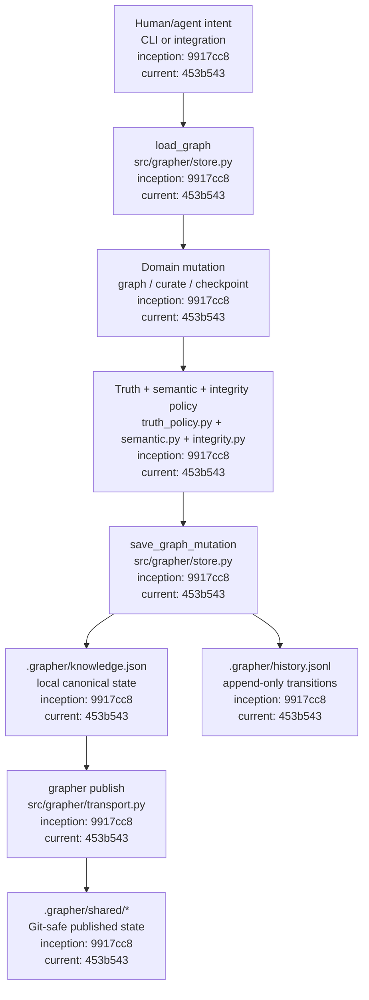
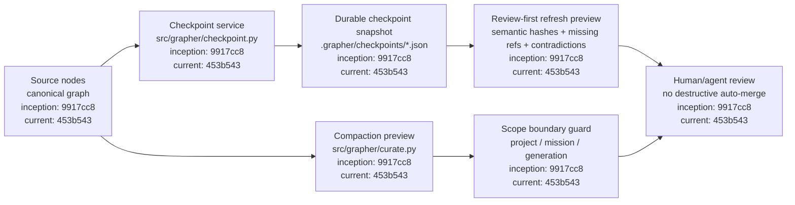

# Grapher Architecture

[Documentation index](INDEX.md) · [Procedures](PROCEDURES.md) · [Roadmap](ROADMAP.md)

This document describes Grapher's current architecture as of the M8 hardening pass. Diagram nodes include the relevant code path plus inception/current commit anchors for traceability.

## Architecture overview

The canonical architectural rule is that all semantic mutations converge on the store boundary. Agent integrations, CLI commands, checkpoint refreshes, and curation must not maintain parallel truth systems.

## Canonical mutation architecture

## Checkpoint and compaction architecture

M8 strengthens two invariants: checkpoint snapshots preserve enough source state to detect semantic drift, and compaction previews may not aggregate across incompatible project/mission/generation scopes.

## Integration priority

Codex is the first-class integration target in M9. Cursor follows after the agent-agnostic contracts are proven. Neither integration owns canonical truth; both use the same CLI/store boundaries.

## Appendix: traceability

The base architecture for this documentation pass is commit `9917cc8af31553841294d69000ac33cc2c53daa6`. M8 checkpoint/compaction implementation before this documentation pass is commit `453b543a64851b0c63797c049c04bcc5f848bf8d`. Future architecture changes must update both this document and the corresponding Grapher self-state record.
