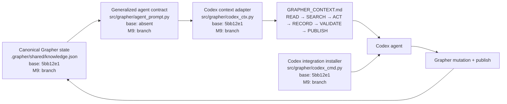
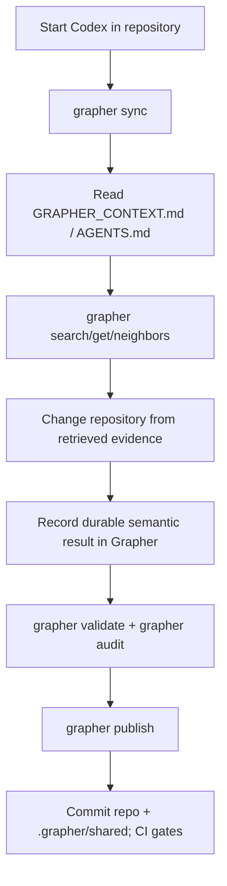

# Codex Integration

[Documentation index](INDEX.md) · [Roadmap](ROADMAP.md) · [Architecture](ARCHITECTURE.md) · [Procedures](PROCEDURES.md)

Milestone 9 makes Codex the first consumer of Grapher's generalized agent prompt/context contract. The contract itself is model-agnostic; Codex-specific code installs and transports it without redefining its semantics.

## Contract

Every generated agent context follows the same operating sequence:

**READ → SEARCH → ACT → RECORD → VALIDATE → PUBLISH**

The renderer lives in `src/grapher/agent_prompt.py`. `src/grapher/codex_ctx.py` is now a thin Codex adapter around that renderer. This keeps later Cursor support from inventing a second semantic contract.

The rendered context includes explicit truth status, verification, scope, deterministic node/edge ordering, and guardrails against recency-based truth inference, finalized-history rewriting, and cross-generation consolidation.

## Codex installation

`grapher codex install` installs the repository `AGENTS.md` section and Grapher Codex skill. At session start Codex should read `.grapher/GRAPHER_CONTEXT.md` when present, then search Grapher before rediscovering state.

The existing transplant commands remain:

```bash
grapher codex export ./kit/
grapher codex receive ./kit/
```

## Acceptance rules

M9 Codex integration is acceptable only when:

1. Codex context rendering uses the generalized renderer rather than a private prompt contract.
2. Generated context is deterministic for the same graph state.
3. Truth status, verification, and scope are visible to the consuming agent.
4. Installed Codex instructions enforce the generalized operating sequence.
5. Tests cover the generalized renderer and Codex adapter.
6. The pass updates Grapher's own `.grapher/shared` state and passes governance CI.

## Architecture diagram



## Procedure flow



The M9 branch begins from M8 merge `5bb12e176e6310759288af10354cea4ddd01703f`.
