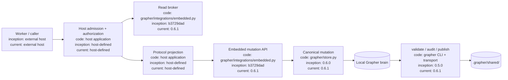
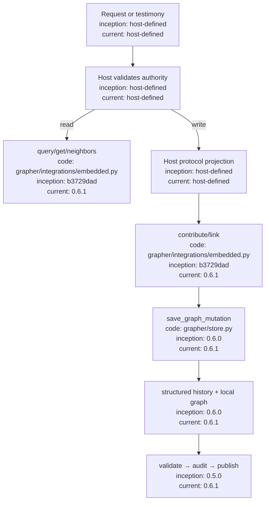

# Embedded Brokering Interface

## Index

- [Purpose](#purpose)
- [Authority model](#authority-model)
- [Setup](#setup)
- [Read brokering](#read-brokering)
- [Write mediation](#write-mediation)
- [Linking and provenance](#linking-and-provenance)
- [Validation and publication](#validation-and-publication)
- [Host integration pattern](#host-integration-pattern)
- [Failure boundaries](#failure-boundaries)
- [Appendix — Architecture](#appendix--architecture)
- [Appendix — Process flow](#appendix--process-flow)

## Purpose

`grapher.integrations.embedded` is the supported host-application boundary for systems that embed Grapher as a durable knowledge substrate. A host application may broker reads, decide who is allowed to submit information, project its own protocol into Grapher-compatible records, and call the embedded API. Grapher remains responsible for graph representation, truth-status policy, semantic integrity, immutable status transitions, canonical history, and rollback.

The embedded interface is host-agnostic. It does not know about Dreadnought, Sarcophagus, Project Arms, or any particular agent framework.

## Authority model

The host owns **admission and authorization**. Grapher owns **durable mutation semantics**.

A host should not give subordinate workers direct write access to `.grapher/knowledge.json` or `.grapher/history.jsonl`. Instead, workers return testimony/evidence to the host; the host validates it and calls the embedded interface.

Direct standalone Grapher use remains valid. The exclusive-writer rule is a host policy, not a restriction imposed by Grapher itself.

## Setup

Initialize a graph using the embedded API:

```python
from pathlib import Path
from grapher.integrations import embedded

workspace = Path("/workspace/project")
graph_path = workspace / ".grapher" / "knowledge.json"

embedded.init_context(
    graph_path,
    scope="project",
    name="example-project",
    domain="software",
)
```

A host that needs custom node types or relations should configure them in `.grapher/config.json`. If newly authored durable records must always declare truth status, set:

```json
{
  "require_explicit_status": true
}
```

## Read brokering

Hosts can expose scoped reads without exposing write authority.

Search:

```python
hits = embedded.query_context(
    graph_path,
    "authentication failure",
    limit=8,
    mission="mission-42",
)
```

Read one node and its adjacent edges:

```python
detail = embedded.get_context(graph_path, "finding-auth-1")
```

Read a bounded neighborhood:

```python
neighborhood = embedded.neighbors_context(
    graph_path,
    "finding-auth-1",
    depth=1,
)
```

A control plane can therefore accept a worker request such as “give me context relevant to order X,” translate that into scoped Grapher queries, and return only the selected records.

## Write mediation

Use `contribute_context()` for host-approved records. Do not edit the state files directly.

```python
node = embedded.contribute_context(
    graph_path,
    type="host_observation",
    title="Login regression reproduced",
    content="The regression occurs after token refresh.",
    node_id="obs-login-refresh",
    status="current",
    workflow_state="active",
    verification="verified",
    stage="developing",
    tags=["auth", "regression"],
    meta={
        "host_record_id": "record-991",
        "raw_protocol": {"kind": "observation", "result": "reproduced"},
    },
    source_refs=["order-42"],
    owners=["control-plane"],
    scope={
        "project_id": "project-a",
        "mission_id": "mission-42",
        "generation_id": "generation-3",
    },
    provenance={
        "actor_id": "control-plane",
        "actor_kind": "system_tool",
        "actor_role": "arbiter",
        "source": "host-protocol",
        "integrity": "declared",
    },
    actor={
        "id": "control-plane",
        "kind": "system_tool",
        "role": "arbiter",
        "source": "host-protocol",
    },
    reason="Validated host observation",
    operation_id="record-991",
    phase="executed",
    source="host-control-plane",
)
```

The embedded interface routes this through Grapher's canonical mutation boundary. Truth policy, semantic integrity, transition materialization, graph persistence, structured history, and rollback remain Grapher responsibilities.

Use host-specific node types when the host's payload schema does not exactly match Grapher's strict native semantic contract. Preserve the full host record in `meta` if a lossless audit trail is required.

## Linking and provenance

Create a relation only after both endpoints exist:

```python
embedded.link_context(
    graph_path,
    "obs-login-refresh",
    "order-42",
    "references",
    actor={
        "id": "control-plane",
        "kind": "system_tool",
        "role": "arbiter",
    },
    reason="Observation references controlling order",
    operation_id="record-991:order",
    source="host-control-plane",
)
```

Prefer Grapher built-in relations where semantics match (`references`, `derived_from`, `part_of`, `evidenced_by`, `applies_to`). Register custom relations only when a host-specific meaning cannot be represented cleanly.

Provenance should identify the writer that actually performed the canonical mutation. The original submitting worker may be preserved separately in `meta`, evidence, or another provenance field defined by the host protocol. Do not mislabel subordinate testimony as control-plane observation.

## Validation and publication

Local state is runtime state. Git-shared state is produced through the publication boundary.

Typical operational sequence:

```bash
grapher validate
grapher audit
grapher publish
git add .grapher/shared
git commit -m "Publish Grapher state"
```

After another checkout pulls published state:

```bash
grapher sync
```

Hosts may invoke equivalent application APIs where appropriate, but should preserve the same boundary: mutate locally, validate/audit, then publish versioned shared state.

## Host integration pattern

A robust broker generally follows this sequence:

1. Receive a worker request or testimony object.
2. Validate the host protocol and actor authority.
3. Decide whether the operation is a read or proposed mutation.
4. For reads, query Grapher and return bounded context.
5. For writes, project the host protocol into a Grapher node and relations.
6. Call `embedded.contribute_context()` / `embedded.link_context()`.
7. Preserve original host testimony losslessly in metadata/evidence when needed.
8. Validate/audit Grapher state.
9. Publish `.grapher/shared/` when the host's Git-governance policy requires publication.

## Failure boundaries

The host should fail closed when protocol validation or authorization fails. Grapher should fail closed when graph/truth/semantic-integrity validation fails. A host must not bypass a Grapher rejection by directly editing the graph file.

`IntegrationError` represents embedded-boundary graph errors such as missing nodes. Canonical persistence failures propagate normally. `save_graph_mutation()` rolls graph state back when structured history append fails.

## Appendix — Architecture



## Appendix — Process flow


