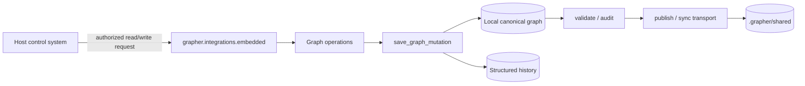
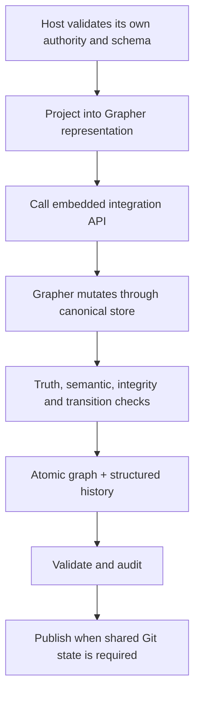

# Embedded Integration

Grapher can be embedded inside a larger control system without surrendering ownership of its durable graph semantics.

Host applications should import `grapher.integrations.embedded` rather than reading or writing `.grapher/knowledge.json` or `history.jsonl` directly. The embedded surface delegates mutations to Grapher's canonical store boundary, preserving truth policy, semantic integrity, status transitions, provenance history, and rollback behavior.

The host remains responsible for authorization and admission policy. Grapher remains responsible for representation and durable mutation correctness. This keeps Grapher independently usable from its CLI while allowing an encapsulating system to act as the only writer in its own runtime.

## Supported boundary

The host-agnostic module currently exposes initialization, query, contribution, relationship, neighborhood, ingestion, inference, reindex, feedback, and delta operations through the same implementation already exercised by Grapher integrations.

A host should pass explicit `source`, `actor`, `scope`, `provenance`, `operation_id`, and `phase` information where available. Host-specific schemas should be projected into Grapher-compatible types and metadata before calling this boundary; hosts must not bypass Grapher validation by editing local state files directly.

## Architecture diagram

## Procedure flow

The legacy `grapher.integrations.agent_hub` module remains available for compatibility. New host systems should prefer `grapher.integrations.embedded`.
