# Grapher installation and updates

## Index

- [Supported beta](#supported-beta)
- [Linux installation](#linux-installation)
- [What the installer does](#what-the-installer-does)
- [Verify installation](#verify-installation)
- [Updating](#updating)
- [Update checks](#update-checks)
- [Development installation](#development-installation)
- [Troubleshooting](#troubleshooting)
- [Appendix — Process flow](#appendix--process-flow)

This guide is the canonical human-facing installation and update reference for Grapher.

## Supported beta

The current public beta line is **v0.7.0b1**. GitHub Releases are the distribution/version authority for normal installations; `main` is development state and is not treated as an installed release.

## Linux installation

Requirements: Linux, Python 3.10+, `git`, and `curl` for the one-line bootstrap.

```bash
curl -fsSL https://raw.githubusercontent.com/seanbman/grapher/main/install.sh | bash
```

From an existing repository checkout:

```bash
bash install.sh
```

The installer does not require `sudo`.

## What the installer does

The installer resolves a published Grapher GitHub release, creates an isolated Python environment under `~/.local/share/grapher/venv`, installs that release, and exposes the executable through `~/.local/bin/grapher`.

If `~/.local/bin` is not already on `PATH`, add it in your shell profile:

```bash
export PATH="$HOME/.local/bin:$PATH"
```

This installation is intentionally separate from a source checkout and from system Python packages.

## Verify installation

```bash
grapher --version
grapher --help
```

For a new project, continue with the repository README and `grapher init`.

## Updating

Re-run the same installer. It resolves the published release line and replaces the isolated installed environment without requiring a system-wide Python mutation.

```bash
curl -fsSL https://raw.githubusercontent.com/seanbman/grapher/main/install.sh | bash
```

## Update checks

Interactive Grapher launches query published GitHub releases and compare the installed semantic version with available releases, including prereleases while on the beta line. A newer release produces a non-blocking notice. Network failure, GitHub unavailability, or offline use does not prevent Grapher from starting.

Non-interactive/automation execution stays quiet. To explicitly suppress checks in an interactive environment:

```bash
GRAPHER_NO_UPDATE_CHECK=1 grapher
```

Update discovery never mutates a project graph and never installs an update automatically.

## Development installation

Contributors who intentionally want editable source behavior can still use a repository-local virtual environment:

```bash
python3 -m venv .venv
source .venv/bin/activate
pip install -e ".[embed,dash]"
```

This is a development workflow, not the recommended end-user installation path.

## Troubleshooting

If `grapher` is not found after installation, verify `~/.local/bin` is on `PATH`. If Python is too old, install Python 3.10+ using the Linux distribution's package mechanism and rerun the installer. For update-check network failures, no repair is required: the check is intentionally best-effort and Grapher continues offline.

## Appendix — Process flow

```mermaid
flowchart LR
    R["Published GitHub release\ncode: .github/workflows/publish-beta.yml\ninception/current beta: 13a1f2ca016ef50c7f2fdc71a9ef9bfd437cc498"] --> I["Linux bootstrap\ncode: install.sh\ninception/current beta: 13a1f2ca016ef50c7f2fdc71a9ef9bfd437cc498"]
    I --> V["Isolated user environment\ncode: ~/.local/share/grapher/venv\ninception/current beta: 13a1f2ca016ef50c7f2fdc71a9ef9bfd437cc498"]
    V --> C["Interactive launch\ncode: src/grapher/main.py\ninception/current beta: 13a1f2ca016ef50c7f2fdc71a9ef9bfd437cc498"]
    C --> U["Non-blocking release check\ncode: src/grapher/update.py\ninception/current beta: 13a1f2ca016ef50c7f2fdc71a9ef9bfd437cc498"]
```



Release anchor: `13a1f2ca016ef50c7f2fdc71a9ef9bfd437cc498` (v0.7.0b1).