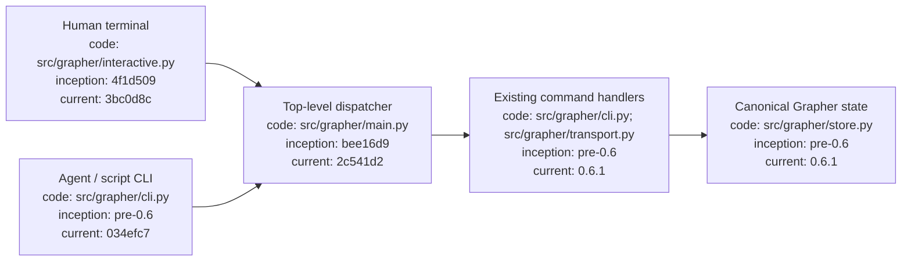
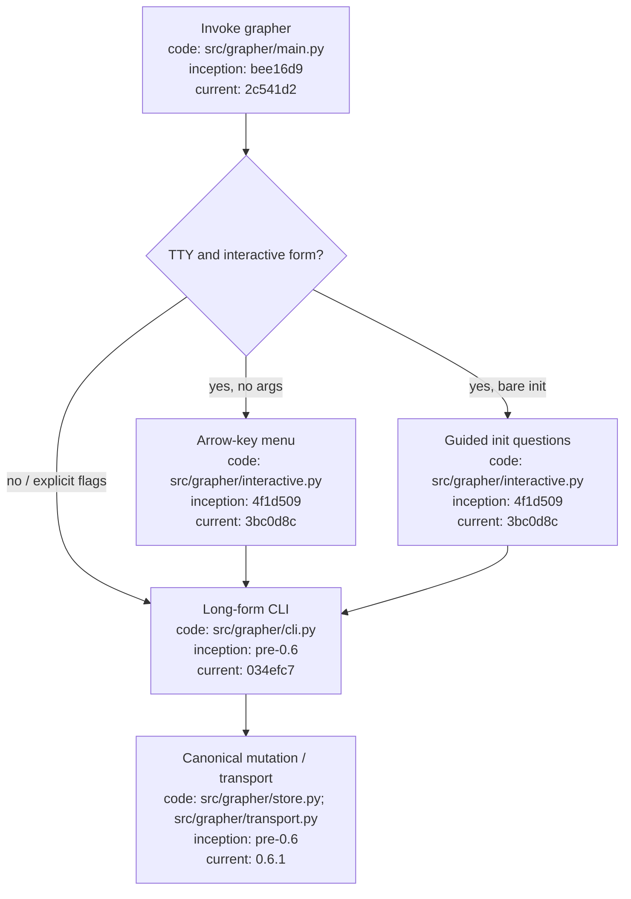

# Grapher Interactive CLI

## Index

- [Purpose](#purpose)
- [Interactive entry points](#interactive-entry-points)
- [Guided initialization](#guided-initialization)
- [Menu operations](#menu-operations)
- [Configuration editing](#configuration-editing)
- [Automation compatibility](#automation-compatibility)
- [Architecture diagram](#architecture-diagram)
- [Procedure flow](#procedure-flow)

## Purpose

Grapher supports two equal interfaces over the same application: a human-friendly terminal UI and the existing long-form CLI for agents, scripts, CI, and reproducible automation. The terminal UI uses arrow-key selection and text input; it does not create a second persistence path.

## Interactive entry points

Run Grapher with no arguments in a terminal to open the menu:

```bash
grapher
```

Run bare `grapher init` in a terminal to start the guided initialization questionnaire:

```bash
grapher init
```

If stdin/stdout are not terminals, Grapher does not invoke dialogs. This prevents automation from hanging.

## Guided initialization

The setup questionnaire asks for graph/project name, profile, optional domain, optional graph kinds, and whether all lifecycle stages should be enabled. It translates those answers into the existing `grapher init --...` command path.

The equivalent non-interactive command remains available:

```bash
grapher init --name example --profile software --domain software --kind knowledge,implementation --all-stages
```

## Menu operations

The main menu currently exposes initialization, search, record creation, audit, publish, sync, configuration editing, and exit. Search and record creation prompt for their required values using stdin/dialog input and dispatch to existing CLI operations.

The menu is intentionally a human convenience layer. Canonical mutation still passes through the same Grapher store, truth policy, validation, semantic integrity, and history mechanisms as long-form commands.

## Configuration editing

Choose **Edit configuration** from the menu to change common human-facing settings such as domain and explicit truth-status enforcement. Configuration is persisted through `grapher.config.save_config()` in `.grapher/config.json`.

Advanced configuration remains editable as JSON and through existing programmatic interfaces; the menu does not hide or replace them.

## Automation compatibility

All long-form commands remain canonical programmatic interfaces. Examples:

```bash
grapher search "token usage"
grapher audit
grapher publish
grapher sync
grapher add --type note --title "Example" --content "Human note" --status current
```

Scripts should prefer explicit long-form commands rather than attempting to drive the interactive menu.

## Architecture diagram



## Procedure flow


