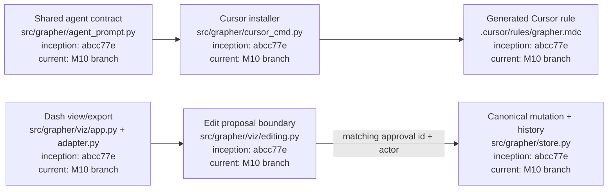
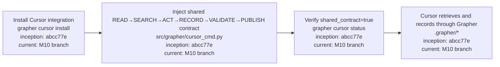

# M10 — Cursor Integration and Approved Dash Editing

M10 reuses the generalized agent contract proven with Codex in M9. Cursor must not define a competing operating model. Dash remains non-canonical by default; any write path must be review-first, explicitly approved, attributable, and journaled.

## Architecture diagram

## Cursor procedure

## Approved Dash edit procedure

```mermaid
flowchart LR
    SELECT["Select current node state\nDash / graph state\ninception: abcc77e\ncurrent: M10 branch"]
    PREVIEW["Create non-mutating proposal + stable proposal_id\npreview_status_edit()\ninception: abcc77e\ncurrent: M10 branch"]
    REVIEW["Human reviews before/after + reason\nUI boundary\ninception: abcc77e\ncurrent: M10 branch"]
    APPROVE["Explicit approval repeats exact proposal_id + actor\napply_approved_status_edit()\ninception: abcc77e\ncurrent: M10 branch"]
    CHECK["Reject stale or mismatched proposal\nsrc/grapher/viz/editing.py\ninception: abcc77e\ncurrent: M10 branch"]
    MUTATE["Curate status + save_graph_mutation\nsrc/grapher/curate.py + store.py\ninception: abcc77e\ncurrent: M10 branch"]
    HISTORY["Immutable transition + journal attribution\n.grapher/history semantics\ninception: abcc77e\ncurrent: M10 branch"]

    SELECT --> PREVIEW --> REVIEW --> APPROVE --> CHECK --> MUTATE --> HISTORY
```

## Safety properties

The export path remains explicitly non-canonical. Edit proposals do not mutate the graph. Approval must match the exact hashed proposal, carry a non-empty reason and human actor attribution, and still match the node's pre-edit status at apply time. If state changed after preview, the edit is rejected and must be previewed again.

## Current M10 scope

The first M10 slice establishes the shared Cursor contract and the canonical approval boundary for Dash status edits. Wiring the approval helper into the interactive Dash controls and completing acceptance coverage remains within M10 before the milestone may be marked completed.
