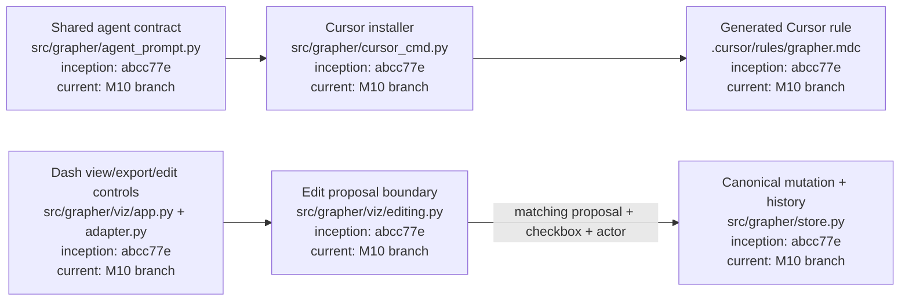
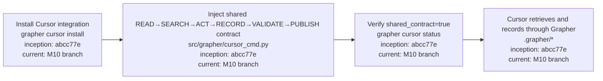

# M10 — Cursor Integration and Approved Dash Editing

M10 reuses the generalized agent contract proven with Codex in M9. Cursor must not define a competing operating model. Dash remains non-canonical by default; any write path must be review-first, explicitly approved, attributable, and journaled.

## Architecture diagram

## Cursor procedure

## Approved Dash edit procedure

```mermaid
flowchart LR
    SELECT["Select current node\nsrc/grapher/viz/app.py\ninception: abcc77e\ncurrent: M10 branch"]
    PREVIEW["Preview exact status change + reason\npreview_status_edit()\ninception: abcc77e\ncurrent: M10 branch"]
    DISPLAY["Display proposal_id + before/after\nsrc/grapher/viz/app.py\ninception: abcc77e\ncurrent: M10 branch"]
    APPROVE["Human supplies actor + explicit approval checkbox\nsrc/grapher/viz/app.py\ninception: abcc77e\ncurrent: M10 branch"]
    CHECK["Verify exact proposal hash and unchanged source state\nsrc/grapher/viz/editing.py\ninception: abcc77e\ncurrent: M10 branch"]
    MUTATE["Curate status + save_graph_mutation\nsrc/grapher/curate.py + store.py\ninception: abcc77e\ncurrent: M10 branch"]
    RELOAD["Reload Dash from canonical disk state\nsrc/grapher/viz/app.py\ninception: abcc77e\ncurrent: M10 branch"]
    HISTORY["Immutable transition + journal attribution\n.grapher/history semantics\ninception: abcc77e\ncurrent: M10 branch"]

    SELECT --> PREVIEW --> DISPLAY --> APPROVE --> CHECK --> MUTATE --> HISTORY --> RELOAD
```

## Safety properties

The export path remains explicitly non-canonical. Edit proposals do not mutate the graph. The interactive Dash flow displays the stable proposal ID and exact before/after state before approval. Applying an edit requires the explicit approval checkbox, a non-empty human actor, the matching proposal hash, a non-empty reason, and an unchanged pre-edit status. If state changed after preview, the edit is rejected and must be previewed again. Successful application reloads the dashboard from canonical disk state rather than trusting an in-memory mutation.

## Current M10 scope

Cursor now consumes the shared M9 operating contract, Dash retains filtered non-canonical export, and the interactive dashboard consumes the approval-gated status-edit boundary. Focused acceptance coverage verifies contract installation, non-mutating previews, mismatched approvals, stale-state rejection, immutable transition creation, and journal attribution. M10 can be marked completed only after the full CI/governance matrix accepts this integrated surface.
