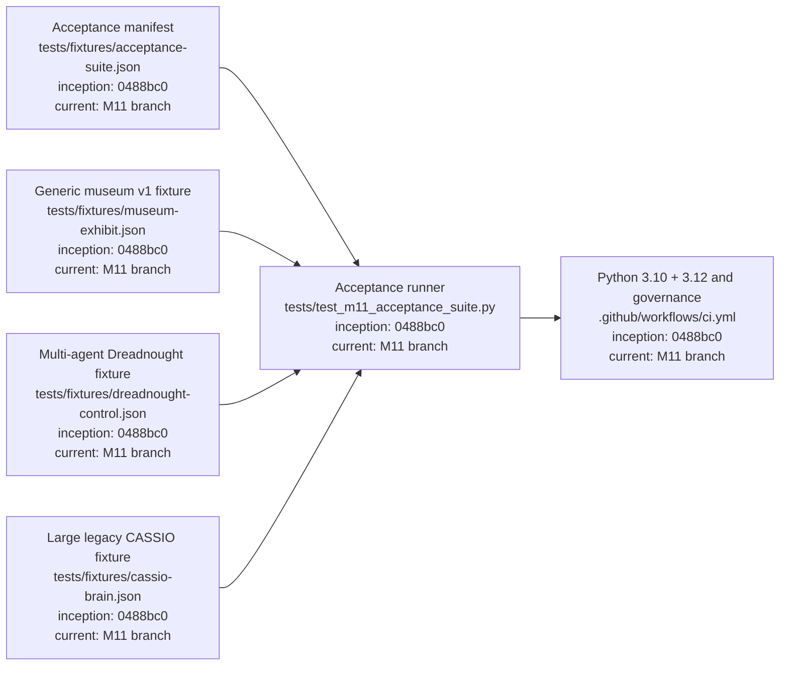
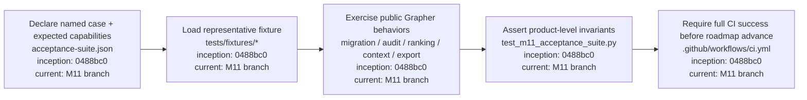

# M11 — Acceptance Fixtures and Tests

M11 turns Grapher's existing representative fixture corpus into an explicit product-level acceptance suite. Each case names the behavior it protects so regressions are evaluated against real usage shapes rather than isolated implementation details.

## Acceptance architecture

## Acceptance procedure

## Cases

`generic-v1-migration` protects non-software compatibility and idempotent migration using the museum fixture. `multi-agent-generation-truth` protects generation scoping, truth-aware ranking, preservation of contaminated historical evidence, generalized agent context, non-canonical Dash export, and audit behavior using the Dreadnought control fixture. `legacy-rich-graph-read` protects inspection compatibility for the large CASSIO legacy corpus without forcing destructive normalization merely to read it.

## Acceptance rule

A fixture is not merely test data. Its manifest entry must state why it exists and which user-visible capabilities it protects. M11 is complete when the declared suite passes on the supported CI matrix and the governance/self-graph gates remain green.
