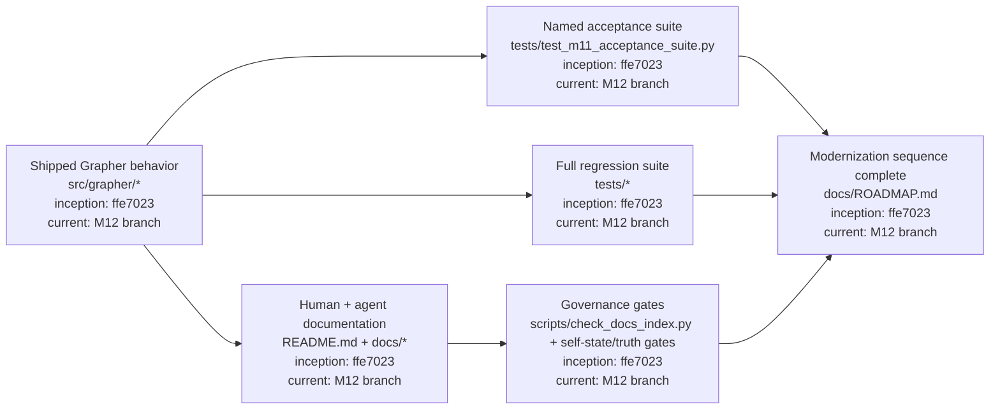
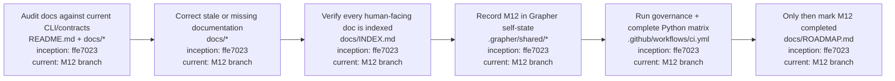

# M12 — Documentation and Full-Suite Completion

M12 closes the numbered Grapher modernization sequence. It does not introduce another architecture layer. It reconciles the human/agent documentation with the behavior proven in M1–M11 and makes the complete governance and regression suite the closure authority.

## Completion architecture

## Completion procedure

## Closure criteria

M12 may be marked completed only when documentation describes the shipped M1–M11 interfaces without known contradictions, the documentation index gate passes, Grapher's versioned self-state records the M12 pass, the named M11 acceptance suite remains green, and the full supported Python test matrix plus truth/governance gates pass.

The five grandfathered `unclassified` records remain separately tracked maintenance debt unless explicitly curated during M12; they do not redefine the numbered modernization sequence.
