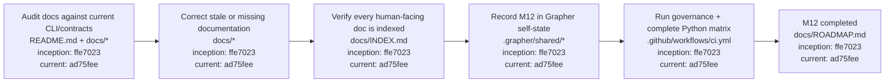

# M12 — Documentation and Full-Suite Completion

M12 closes the numbered Grapher modernization sequence. It does not introduce another architecture layer. It reconciles the human/agent documentation with the behavior proven in M1–M11 and makes the complete governance and regression suite the closure authority.

M12 is complete. The closure framework entered `main` at `1e3a15bad6b8b38b523eda9023e1ee92dc2947d2`; the post-modernization technology-debt sweep and final closure verification entered `main` at `ad75fee8df1f33cd8890bfbd23924b35cc6f4903`.

## Completion architecture

## Completion procedure

## Closure evidence

M12 closure is supported by the named M11 acceptance suite, indexed architecture/procedure documentation, Grapher self-state records, strengthened self-state validation, explicit truth-status enforcement, package build and installed CLI smoke tests, research validation, and the complete Python 3.10/3.12 regression matrix.

The five grandfathered `unclassified` records remain separately tracked maintenance debt; they do not redefine or reopen the completed numbered modernization sequence.
