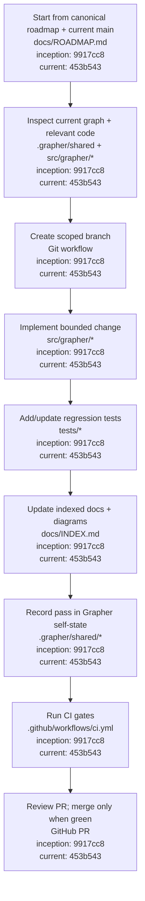
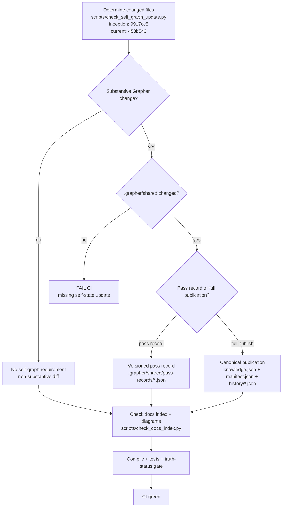
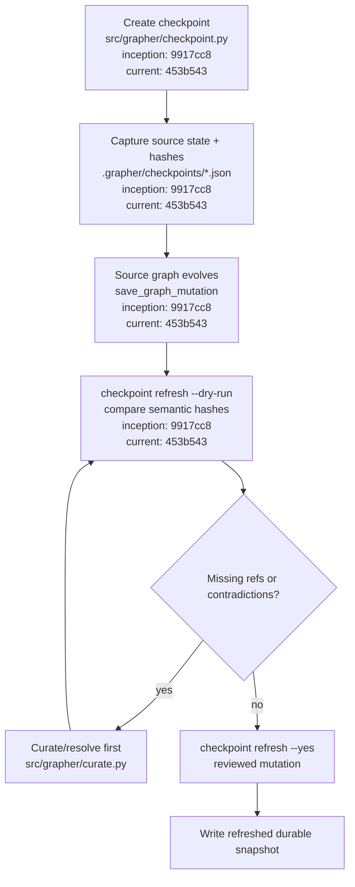
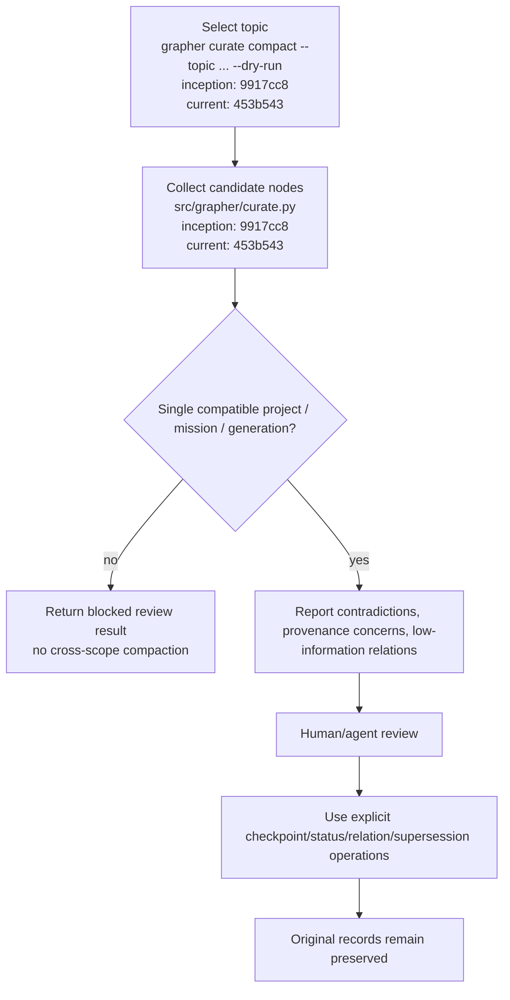

# Grapher Procedures

[Documentation index](INDEX.md) · [Architecture](ARCHITECTURE.md) · [Roadmap](ROADMAP.md)

These procedures define the required operating flow for substantive Grapher changes. The diagrams are executable policy descriptions: code, documentation, tests, and Grapher's own `.grapher` state advance together.

## Standard change procedure

A code-only pass is incomplete. Documentation-only changes that alter architecture, policy, procedures, roadmap, or agent behavior are also substantive and must carry a self-state record.

## Self-graph and CI procedure

A pass record is lightweight evidence that the pass was represented inside versioned `.grapher/shared` state. A canonical publication remains the stronger form and is required whenever the canonical graph itself changes. Pass records must not be used as a substitute for publishing semantic graph mutations.

## Checkpoint refresh procedure

Checkpoint refresh is review-first. Timestamp changes alone are insufficient evidence; semantic snapshot hashes are used to detect actual source drift.

## Compaction preview procedure

Compaction never silently deletes disagreement, rewrites provenance, or crosses mission-generation boundaries. It proposes consolidation; explicit curation performs any accepted change.

## Pull-request acceptance checklist

1. Roadmap consulted and milestone/maintenance classification is correct.
2. Code and tests advance together.
3. Human-facing documentation remains indexed.
4. Architecture/procedure diagrams are updated when affected.
5. Grapher's own `.grapher/shared` state records the pass.
6. `validate`, `audit`, test suite, truth-status gate, documentation gate, and self-graph gate pass.
7. Merge occurs only after the branch head associated with the green CI run is verified.

## Appendix: traceability

Procedure baseline: `9917cc8af31553841294d69000ac33cc2c53daa6`. M8 implementation state before procedure/documentation hardening: `453b543a64851b0c63797c049c04bcc5f848bf8d`.
