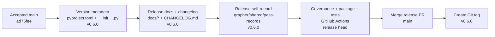

# Grapher v0.6.0 Release Record

Version `0.6.0` packages the completed M1–M12 modernization sequence plus the accepted post-modernization technology-debt sweep.

## Release baseline

- Previous release: `v0.5.0`
- Modernization closure framework: `1e3a15bad6b8b38b523eda9023e1ee92dc2947d2`
- Post-modernization debt sweep and closure verification: `ad75fee8df1f33cd8890bfbd23924b35cc6f4903`
- Release branch: `release/v0.6.0`

## Included capabilities

The release includes typed semantic contracts, Git-backed publish/sync transport, truth-aware retrieval, immutable status transitions, durable checkpoints, generation-safe compaction previews, the generalized agent contract proven with Codex and reused by Cursor, approval-gated Dash editing, named acceptance fixtures, indexed architecture/procedure documentation, and strengthened CI/self-graph governance.

## Release procedure

## Verification requirement

The release is valid only after the release head passes documentation governance, Grapher self-state validation, package build and installed CLI smoke tests, explicit truth-status enforcement, named acceptance coverage, research validation, and the Python 3.10/3.12 regression matrix.

Known deferred maintenance remains tracked in [TECH_DEBT_REVIEW_2026-09-06.md](TECH_DEBT_REVIEW_2026-09-06.md); it does not block this release.
