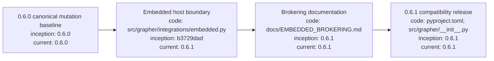

# Grapher 0.6.1

## Index

- [Purpose](#purpose)
- [Compatibility baseline](#compatibility-baseline)
- [Upgrade guidance](#upgrade-guidance)
- [Verification](#verification)
- [Appendix — Process flow](#appendix--process-flow)

## Purpose

Grapher 0.6.1 is the compatibility release that stabilizes the host-agnostic embedded integration boundary introduced after 0.6.0. It does not change Grapher into a control plane; it formalizes the API that control planes may use when they embed Grapher as a durable knowledge substrate.

## Compatibility baseline

The 0.6.1 embedded boundary provides host applications with initialization, querying, bounded context reads, contribution, linking, ingest, reindex, delta, and inference helpers while routing canonical writes through Grapher's existing mutation machinery.

Host applications own admission and authorization. Grapher owns durable representation, truth policy, semantic integrity, immutable transitions, history, and rollback.

See [EMBEDDED_BROKERING.md](EMBEDDED_BROKERING.md) for practical integration examples.

## Upgrade guidance

Applications embedding Grapher should target 0.6.1 or later within the 0.6 compatibility line. Do not rely on direct `.grapher/knowledge.json` or `.grapher/history.jsonl` mutation.

Standalone Grapher users do not need to change their normal CLI workflow.

## Verification

Release acceptance requires the normal test suite, documentation index check, package build/install smoke tests, and Grapher self-graph gate to pass in CI.

## Appendix — Process flow

