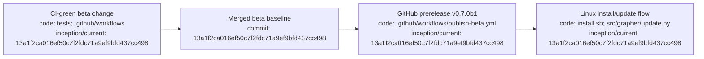

# Grapher v0.7.0b1 beta release

## Index

- [Status](#status)
- [What changed](#what-changed)
- [Installation](#installation)
- [Compatibility](#compatibility)
- [Verification](#verification)
- [Appendix — Process flow](#appendix--process-flow)

## Status

v0.7.0b1 is the current public Grapher beta, published as a GitHub prerelease from merge commit `13a1f2ca016ef50c7f2fdc71a9ef9bfd437cc498`.

## What changed

The beta establishes the Linux end-user distribution path: a no-sudo per-user installer, isolated environment, launcher under `~/.local/bin`, semantic-version release discovery, non-blocking interactive update notices, and an automated beta publication workflow. Existing canonical mutation, truth, integrity, history, embedded integration, and Git publication semantics remain the core contract.

## Installation

Use [`INSTALLATION_AND_UPDATES.md`](INSTALLATION_AND_UPDATES.md). The normal Linux entry point is `install.sh` from the repository or the one-line bootstrap documented there.

## Compatibility

The embedded boundary introduced in v0.6.1 remains available. Dreadnought v0.2.0b1 consumes Grapher v0.7.0b1 as its matched beta compatibility line.

## Verification

The release branch passed Grapher governance, Python 3.10 and 3.12 tests, package build, installed CLI smoke tests, truth-status enforcement, and release-version regression coverage before merge and prerelease publication.

## Appendix — Process flow

