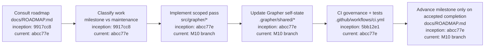

# Grapher Canonical Roadmap

[Documentation index](INDEX.md) · [Architecture](ARCHITECTURE.md) · [Procedures](PROCEDURES.md) · [Codex integration](CODEX_INTEGRATION.md) · [M10 Cursor/Dash](M10_CURSOR_DASH_EDITING.md)

This document is the authoritative numbered implementation sequence for Grapher. Agents and humans MUST consult it before declaring the "next milestone". Remediation, bug fixes, security work, truth-state hardening, and maintenance do not renumber or displace these milestones unless this roadmap is explicitly revised.

## Milestones

| ID | Milestone | State |
|---|---|---|
| M1 | Architecture and baseline | completed |
| M2 | Registries, normalized models, and v1 reader | completed |
| M3 | v2 serialization and migration | completed |
| M4 | CLI flags | completed |
| M5 | Validation and audit | completed |
| M6 | Truth-aware relations, supersession, and retrieval | completed |
| M7 | Grapher-to-Dash adapter and visualization | completed |
| M8 | Checkpoints and compaction previews | completed |
| M9 | Generalized prompts and **Codex integration** | completed |
| M10 | **Cursor integration**, Dash export, and approved editing | **next** |
| M11 | Acceptance fixtures and tests | planned |
| M12 | Documentation and full-suite completion | planned |

## Integration priority

Codex is the first-class agent integration target. M9 proved the generalized agent-facing contract with Codex. M10 reuses that stabilized contract for Cursor and extends Dash from non-canonical export toward explicit review-and-approval edit flows.

## State rules

- `completed`: milestone acceptance criteria have been met.
- `next`: the next numbered milestone to advance.
- `planned`: ordered future work.
- Maintenance and remediation are tracked separately from the numbered sequence.
- A milestone state or ordering change requires an explicit roadmap update; it must not be inferred from recent work.

## Current maintenance debt

Truth-state admission hardening was merged after M7. It is maintenance/hardening, not a numbered milestone. Five grandfathered `unclassified` records remain a finite curation queue and do not displace M10.

## Agent rule

Before answering roadmap questions such as "what is next?", agents should consult this file and, where available, the corresponding canonical Grapher roadmap records. Repository state and recent PR chronology are not substitutes for the declared roadmap.

Every substantive Grapher pass must also update versioned `.grapher/shared` self-state. CI enforces this rule; see [PROCEDURES.md](PROCEDURES.md#self-graph-and-ci-procedure).

## Appendix: roadmap procedure flow

Architecture details: [ARCHITECTURE.md](ARCHITECTURE.md). Operating procedure: [PROCEDURES.md](PROCEDURES.md). Codex contract: [CODEX_INTEGRATION.md](CODEX_INTEGRATION.md). M10 design: [M10_CURSOR_DASH_EDITING.md](M10_CURSOR_DASH_EDITING.md).
