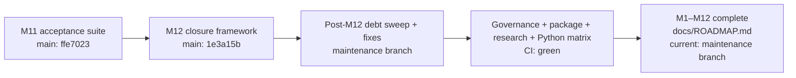

# Grapher Canonical Roadmap

[Documentation index](INDEX.md) · [Architecture](ARCHITECTURE.md) · [Procedures](PROCEDURES.md) · [Codex integration](CODEX_INTEGRATION.md) · [M10 Cursor/Dash](M10_CURSOR_DASH_EDITING.md) · [M11 acceptance](M11_ACCEPTANCE.md) · [M12 completion](M12_COMPLETION.md)

This document is the authoritative numbered implementation sequence for Grapher. Agents and humans MUST consult it before declaring the "next milestone". Remediation, bug fixes, security work, truth-state hardening, and maintenance do not renumber or displace these milestones unless this roadmap is explicitly revised.

## Milestones

| ID | Milestone | State |
|---|---|---|
| M1 | Architecture and baseline | completed |
| M2 | Registries, normalized models, and v1 reader | completed |
| M3 | v2 serialization and migration | completed |
| M4 | CLI flags | completed |
| M5 | Validation and audit | completed |
| M6 | Truth-aware relations, supersession, and retrieval | completed |
| M7 | Grapher-to-Dash adapter and visualization | completed |
| M8 | Checkpoints and compaction previews | completed |
| M9 | Generalized prompts and **Codex integration** | completed |
| M10 | **Cursor integration**, Dash export, and approved editing | completed |
| M11 | Acceptance fixtures and tests | completed |
| M12 | Documentation and full-suite completion | completed |

## Modernization state

The M1–M12 modernization sequence is complete. The closure evidence is the accepted M11 product fixture suite plus the post-M12 maintenance verification that passed governance, strengthened self-state validation, package build/CLI smoke checks, truth-status enforcement, research validation, and the full Python 3.10/3.12 regression matrix.

There is no implicit M13. Future numbered work requires an explicit roadmap revision. Until then, fixes, curation, refactors, releases, and operational improvements are maintenance work and must not be described as a new numbered milestone.

## Integration priority

Codex remains the first-class agent integration target. M9 proved the generalized contract with Codex; M10 reused it for Cursor and approval-gated Dash editing; M11 proved accumulated behavior against named acceptance fixtures; M12 reconciled and closed the documented implementation sequence.

## State rules

- `completed`: milestone acceptance criteria have been met.
- `next`: the next numbered milestone to advance; none exists after M12 unless this roadmap is revised.
- `planned`: ordered future work.
- Maintenance and remediation are tracked separately from the numbered sequence.
- A milestone state or ordering change requires an explicit roadmap update; it must not be inferred from recent work.

## Current maintenance debt

The indexed [technology debt review](TECH_DEBT_REVIEW_2026-09-06.md) is authoritative for post-modernization debt. Known structural items include CLI modularization, the intentional v1 compatibility horizon, five grandfathered `unclassified` records awaiting immutable curation, and dedicated high-memory embedding verification for relevant releases.

## Agent rule

Before answering roadmap questions such as "what is next?", agents should consult this file and the corresponding canonical Grapher records. Repository state and recent PR chronology are not substitutes for the declared roadmap. With M12 completed, agents must not invent a new numbered milestone; propose maintenance or an explicit roadmap revision instead.

Every substantive Grapher pass must also update versioned `.grapher/shared` self-state. CI enforces this rule; see [PROCEDURES.md](PROCEDURES.md#self-graph-and-ci-procedure).

## Appendix: roadmap completion flow

Architecture details: [ARCHITECTURE.md](ARCHITECTURE.md). Operating procedure: [PROCEDURES.md](PROCEDURES.md). M11 acceptance suite: [M11_ACCEPTANCE.md](M11_ACCEPTANCE.md). M12 closure: [M12_COMPLETION.md](M12_COMPLETION.md). Post-modernization debt: [TECH_DEBT_REVIEW_2026-09-06.md](TECH_DEBT_REVIEW_2026-09-06.md).
