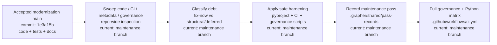
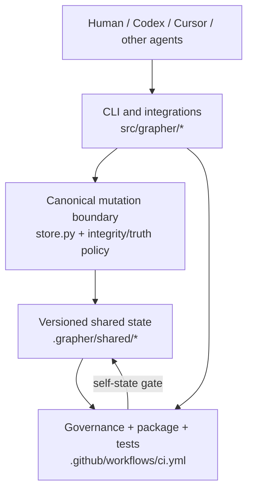

# Grapher Technology Debt Review — 2026-09-06

This review follows completion of the M1–M12 modernization sequence. It is maintenance work and does not create or renumber a milestone.

## Summary

The repository is in strong functional shape after M11 acceptance and the M12 closure framework, but several maintainability and governance debts remained. This pass resolves the safe, high-value items immediately and records larger structural work explicitly instead of hiding it inside unrelated changes.

## Resolved in this pass

| Area | Debt | Resolution |
|---|---|---|
| Package metadata | `pyproject.toml` still described Grapher as a Cursor/Codex-specific CLI | Reworded as a project-local durable work graph for humans and autonomous agents, matching the shipped architecture |
| Self-graph governance | CI accepted any sufficiently large JSON file under `pass-records/` | Pass records are now parsed and structurally validated for identity, explicit status, semantic/content payload, and actor/source provenance |
| Packaging confidence | CI compiled and tested the editable source tree but did not prove the package/CLI could actually build and start | Added `uv build`, import smoke testing, and `grapher --help` execution on Python 3.10 and 3.12 |
| Debt visibility | No single post-modernization debt ledger existed | This indexed review now records resolved and deferred debt with ownership boundaries |

## Structural debt retained deliberately

### CLI monolith

`src/grapher/cli.py` is approximately 60 KB and remains the largest concentration of dispatch, argument parsing, and command orchestration. It is functioning and covered by the existing suite, so splitting it during a broad cleanup would create unnecessary regression risk.

Recommended follow-up: extract command families behind stable handlers (`checkpoint`, `curate`, `migrate`, `integrations`, `dash`, query/read commands) while preserving the current CLI surface and adding parser/dispatch contract tests before each extraction.

### Legacy v1 compatibility

Read-only v1 compatibility and migration remain intentional product behavior. They are not dead code while legacy fixture compatibility is part of M11 acceptance. Removal should happen only through an explicit deprecation policy and migration horizon, not opportunistic cleanup.

### Five grandfathered `unclassified` records

The truth-status allowlist still contains five historical records created before explicit truth-state admission became mandatory. They are a finite curation queue, not a reason to weaken the current gate. They should be curated through Grapher's immutable status-transition path and then removed from the allowlist. Direct JSON status edits are prohibited.

### Optional embedding test isolation

The default suite intentionally excludes the high-memory embedding integration. This is acceptable for ordinary CI, but release automation should continue to run the dedicated embedding test path before releases that modify embedding/search behavior.

## Review procedure

## Architecture impact

## Completion rule

This maintenance pass is complete only after the strengthened governance gate, package build/CLI smoke checks, truth-status gate, acceptance suite, and full Python 3.10/3.12 regression matrix all pass. Structural items listed above remain explicit follow-up debt rather than being silently treated as fixed.
